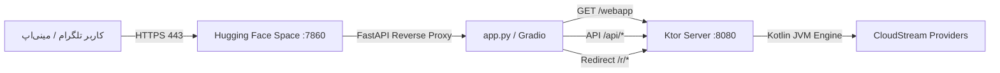

# 🚀 راهنمای استقرار و مدیریت TeleStream روی Hugging Face

این راهنما تمامی مراحل راه‌اندازی خودکار، اتصال مینی‌اپ در تلگرام، و تنظیمات مورد نیاز در **Hugging Face Spaces** را گام‌به‌گام توضیح می‌دهد.

---

## 📑 فهرست مطالب
1. [استقرار خودکار با GitHub Actions (روش پیشنهادی)](#1-استقرار-خودکار-با-github-actions)
2. [راه‌اندازی مینی‌اپ در تلگرام با @BotFather](#2-راه‌اندازی-مینی‌اپ-در-تلگرام-با-botfather)
3. [متغیرهای محیطی در Hugging Face Space](#3-متغیرهای-محیطی-در-hugging-face-space)
4. [معماری شبکه و پورت‌ها](#4-معماری-شبکه-و-پورت‌ها)
5. [استقرار دستی (روش جایگزین)](#5-استقرار-دستی-روش-جایگزین)

---

## ۱. استقرار خودکار با GitHub Actions

یک ورک‌فلو خودکار در مسیر `.github/workflows/deploy-hf.yml` تعبیه شده است. با فعال‌سازی آن، هر بار که به برنچ `main` پوش کنید، گیت‌هاب:
1. پروژه را کامپایل کرده و `telestream-all.jar` را می‌سازد.
2. با سرعت ابری گیگابیتی فایل‌ها را مستقیماً روی هاگینگ‌فیس آپلود می‌کند (بدون درگیری با سرعت اینترنت داخلی).

### 🔑 مراحل فعال‌سازی:
1. در ریپازیتوری گیت‌هاب خود به تب **Settings** بروید.
2. از منوی سمت چپ مسیر **Secrets and variables** ⬅️ **Actions** را باز کنید.
3. روی دکمه سبز **New repository secret** کلیک کنید:
   * **Name:** `HF_TOKEN`
   * **Secret:** توکن حساب هاگینگ‌فیس شما با دسترسی **Write** (از مسیر [huggingface.co/settings/tokens](https://huggingface.co/settings/tokens)).
4. روی **Add secret** بزنید.

از این پس هر کامیت در `main` یا کلیک روی دکمه **Run workflow** در تب Actions گیت‌هاب، به‌صورت خودکار Space شما را در چند ثانیه به‌روزرسانی می‌کند!

---

## ۲. راه‌اندازی مینی‌اپ در تلگرام با @BotFather

مینی‌اپ تله‌استریم بر روی آدرس زیر در هاگینگ‌فیس سرو می‌شود:
```
https://kazemcodes-telestream-bot.hf.space/webapp
```

### روش اول: دکمه منوی کنار چت (Chat Menu Button)
این دکمه در پایین چت کنار کادر نوشتن پیام قرار می‌گیرد و با یک لمس، مینی‌اپ را به‌صورت کشویی (Bottom Sheet) باز می‌کند:
1. در تلگرام به ربات [@BotFather](https://t.me/BotFather) بروید.
2. دستور `/setmenubutton` را ارسال کنید.
3. ربات خود (`@telecloudstreambot`) را انتخاب کنید.
4. آدرس مینی‌اپ را وارد کنید:
   ```text
   https://kazemcodes-telestream-bot.hf.space/webapp
   ```
5. عنوان دکمه را وارد کنید:
   ```text
   🎬 TeleStream
   ```

### روش دوم: ساخت لینک اختصاصی مینی‌اپ (Direct Mini App Link)
برای اینکه لینکی شبیه `t.me/telecloudstreambot/play` داشته باشید و بتوانید آن را در کانال‌ها و گروه‌ها به اشتراک بگذارید:
1. در `@BotFather` دستور `/newapp` را بفرستید.
2. ربات خود را انتخاب کنید.
3. عنوان مینی‌اپ را وارد کنید: `TeleStream`
4. توضیحات دلخواه و سپس یک تصویر آیکون (۶۴۰x۳۶۰) بفرستید.
5. برای دمو می‌توانید `/empty` بزنید.
6. آدرس وب‌اپ را بفرستید:
   ```text
   https://kazemcodes-telestream-bot.hf.space/webapp
   ```
7. یک شناسه کوتاه انتخاب کنید (مثلاً `play` یا `watch`).
8. لینک مستقیم شما آماده است: `https://t.me/YourBot/play`

---

## ۳. متغیرهای محیطی در Hugging Face Space

در صفحه Space خود در هاگینگ‌فیس:
`https://huggingface.co/spaces/kazemcodes/telestream-bot/settings`

به بخش **Variables and secrets** بروید و مقادیر زیر را در بخش **New secret** اضافه کنید:

| نام متغیر (Secret) | مقدار / توضیح |
| :--- | :--- |
| `BOT_TOKEN` | توکن ربات تلگرام دریافتی از BotFather |
| `ADMIN_IDS` | شناسه عددی تلگرام ادمین‌ها (مثال: `12345678,87654321`) |
| `ENABLE_DOH` | `true` (فعال‌سازی DNS ضد فیلترینگ کلودفلر/گوگل) |
| `DONATION_USDT_TRC20` | `TBor8Rmq1UNeQ6kZMnxUPqRns3aU8tsD1D` |
| `DONATION_BTC` | `bc1qlh484m8e0ff4pewvuyu0xg7tc7zzynzkj6ufcx` |
| `DONATION_ETH` | `0x86dA13b11011B7Bdff2259B576AD5c1c9E94d3Ef` |
| `DONATION_TON` | `UQDP14pSjV1k8L0Fj8d2p7k8XqZ7YjB7p9` |

---

## ۴. معماری شبکه و پورت‌ها

هاگینگ فیس ترافیک خارجی HTTPS را به پورت `7860` هدایت می‌کند:


* **پورت داخلی Ktor:** روی `8080` اجرا می‌شود (`GET /webapp`, `GET /api/*`, `GET /r/*`).
* **پورت بیرونی (7860):** توسط `app.py` هندل می‌شود که ترافیک `/webapp` و `/api/*` را مستقیم به Ktor پراکسی می‌کند.
* **داشبورد Gradio:** در روت (`/`) اجرا شده و علاوه بر بررسی وضعیت، امکان تست وب‌پلیر را در مرورگر فراهم می‌سازد.

---

## ۵. استقرار دستی (روش جایگزین)

اگر تمایل دارید شخصاً فایل‌ها را پوش کنید:

```bash
# ۱. ساخت JAR بهینه‌شده
./gradlew fatJar -x test --no-daemon

# ۲. انتقال فایل به برنچ استقرار هاگینگ‌فیس
git checkout hf-space
cp build/libs/telestream-all.jar telestream-all.jar
git add telestream-all.jar app.py requirements.txt README.md
git commit -m "build: update space deployment"

# ۳. پوش به هاگینگ‌فیس
git push hf hf-space:main
```
*(توجه: توصیه می‌شود از روش خودکار GitHub Actions در بخش ۱ استفاده کنید تا بدون معطلی و با بیشترین سرعت آپلود شود).*
